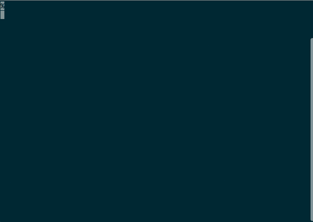

# Lazy Linter

This python 3 module is a universal linter for all the
programming languages and files.

If you are a lazy programmer and wanna keep your
code always with 100% of perfect status, this linter
is for you.

## Requirements:

- Python >= 3

## Preview:



## Quickstart

Lazy Linter is really easy to use, simply copy the
`lazylinter.py` file to your root repository and run:

```
python3 lazylinter.py
```

#### Fast mode:

If you need a very fast analysis, only add the `-f` param:

```
python3 lazylinter.py -f
```

## Real case of use

If you wanna test your deploy on a continuous integrations service,
this library is suitable for you. Only don't forget to put a real
linter when you go on production.

## License

Licensed under a MIT License:

```
The MIT License (MIT)

Copyright (c) 2017 Otoniel Jiménez

Permission is hereby granted, free of charge, to any person obtaining a copy
of this software and associated documentation files (the "Software"), to deal
in the Software without restriction, including without limitation the rights
to use, copy, modify, merge, publish, distribute, sublicense, and/or sell
copies of the Software, and to permit persons to whom the Software is
furnished to do so, subject to the following conditions:

The above copyright notice and this permission notice shall be included in
all copies or substantial portions of the Software.

THE SOFTWARE IS PROVIDED "AS IS", WITHOUT WARRANTY OF ANY KIND, EXPRESS OR
IMPLIED, INCLUDING BUT NOT LIMITED TO THE WARRANTIES OF MERCHANTABILITY,
FITNESS FOR A PARTICULAR PURPOSE AND NONINFRINGEMENT. IN NO EVENT SHALL THE
AUTHORS OR COPYRIGHT HOLDERS BE LIABLE FOR ANY CLAIM, DAMAGES OR OTHER
LIABILITY, WHETHER IN AN ACTION OF CONTRACT, TORT OR OTHERWISE, ARISING FROM,
OUT OF OR IN CONNECTION WITH THE SOFTWARE OR THE USE OR OTHER DEALINGS IN
THE SOFTWARE.
```
